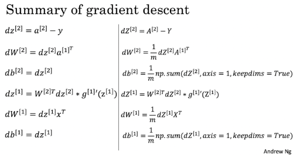

# Neural Networks and Deep Learning

- [Neural Networks and Deep Learning](#neural-networks-and-deep-learning)
  - [W2A1: Python Basics with Numpy](#w2a1-python-basics-with-numpy)
  - [W2A2: Logistic Regression with a Neural Network mindset](#w2a2-logistic-regression-with-a-neural-network-mindset)
  - [2-layer NN calculation](#2-layer-nn-calculation)
    - [NN notation setup](#nn-notation-setup)
    - [Forward](#forward)
    - [Cost](#cost)
    - [Backward](#backward)
  - [W3A1 Planar data classification with one hidden layer](#w3a1-planar-data-classification-with-one-hidden-layer)
  - [W4A1 Building your Deep Neural Network: Step by Step](#w4a1-building-your-deep-neural-network-step-by-step)

## W2A1: Python Basics with Numpy

- $\displaystyle \operatorname{sigmoid}(x) = \sigma(x) = \frac{1}{1+e^{-x}}, \quad \frac{d\sigma}{dx} = \sigma(1-\sigma) .$
- $\displaystyle \mathrm{softmax}(\mathbf{x}) = \begin{pmatrix} \frac{e^{x_1}}{\sum_j e^{x_j}} \\ \vdots \\ \frac{e^{x_n}}{\sum_j e^{x_j}} \end{pmatrix}$
- `axis=1` in parameters means, for matrix, reduce along rows and generate a column vector. E.g. see [np.linalg.norm](#numpy-functions)
- **Always** `keepdims=True`
- Make use of **broadcasting**.

## W2A2: Logistic Regression with a Neural Network mindset

- Reshape dataset:
  ```python
  # data.shape = (num_imgs, img_height, img_width, img_channels)
  data = data.reshape(data.shape[0], -1).T
  # data.shape = (size_of_img_vec, num_imgs)
  ```
- Preprocessing common steps:
  - Figure out the dimensions
  - Reshape
  - Standardize, for images, devide every image vector by 255
- Algorithm for **logistic regression** (single feature neural):
  - Neuron: $\hat{Y} = A = \sigma(Z) = \sigma(\mathbf{w}^T \mathbf{X}+b)$
  - Cost : $\displaystyle J = \frac{1}{m} \sum_i {L}(\hat y ^{(i)}, y ^{(i)}) = -\frac{1}{m}\sum_{i=1}^{m}\Big(y^{(i)}\ln(\hat y^{(i)})+(1-y^{(i)})\ln(1-\hat y^{(i)})\Big)$
  - Derivatives : $\displaystyle \frac{dL}{dz} = \hat y-y, \quad \frac{\partial J}{\partial \mathbf{w}} = \frac{1}{m}X(\hat{Y}-Y)^T , \quad \displaystyle \frac{\partial J}{\partial b} = \frac{1}{m} \sum_{i=1}^m (\hat{y}^{(i)}-y^{(i)})$
- Functions in this assignment:
  - `initialize(dim) => w: of shape(dim, 1), b: number`
  - `propagate(w, b, X, Y) => grads{dw, db}, cost: number`
  - `optimize(w, b, X, Y, num_iterations, learning_rate, print_cost) => params{w, b}, grads{dw, db}, cost: number`
  - `predict(w, b, X) => Yhat`
  - Model:
    ```python
    def model(X_train, Y_train, X_test, Y_test, 
      num_iterations=2000, learning_rate=0.5, print_cost=False):
      
        d = {
          "costs": costs,
          "Y_prediction_test": Y_prediction_test, 
          "Y_prediction_train" : Y_prediction_train, 
          "w" : w, 
          "b" : b,
          "learning_rate" : learning_rate,
          "num_iterations": num_iterations`
        }
        return d
    ```

## 2-layer NN calculation

### NN notation setup

1. $X=(x ^{(1)}, x ^{(2)}, \dots, x ^{(m)})$ has shape $(n_x \times m)$ with $n_x$ being size of features, $m$ being number of training examples.
1. $Y=(y ^{(1)}, y ^{(2)}, \dots, y ^{(m)})$ has shape $(1\times m)$, each a boolean variable.
1. $\displaystyle x^{(i)}$ is the $i$-th training example
1. $\square^{[j](i)}_k$ means the $k$-th neuron in $j$-th layer, acting on $i$-th training example.
   1. $\square^{[i]}$ means for $i$-th hidden layer (input layer counted as 0-th)

### Forward

$$ \begin{aligned}
  a ^{[0]} &= {X} \\
  z ^{[1]} &= W ^{[1]} a ^{[0]} + b ^{[1]} \\
  a ^{[1]} &= \tanh ( z ^{[1]} ) \\
  z ^{[2]} &= W ^{[2]} a ^{[1]} + b ^{[2]} \\
  a ^{[2]} &= \sigma ( z ^{[2]} ) \\
  \hat {Y} &= a ^{[2]}
\end{aligned} $$

### Cost

$$ \begin{aligned}
  J & = - \frac{1}{m} \sum\limits_{i = 1}^{m} \large{(} \small y^{(i)}\ln\left(a^{[2] (i)}\right) + (1-y^{(i)})\ln\left(1- a^{[2] (i)}\right) \large{)} \small\tag{13} \\
  & = -\frac{1}{m} \Big(\mathbf{Y} \cdot \ln ( \mathbf{a} ^{[2]} )^T + (1 - \mathbf{Y}) \cdot \ln ( 1 - \mathbf{a} ^{[2]} )^T )
\end{aligned} $$

### Backward

Notation: $\circ$ denotes Hadamard elementwise product.

- First layer

  $$ \newcommand{\pdiff}[1]{\frac{\partial J}{\partial #1}} \begin{aligned}
    \pdiff{z ^{[2]}} &= a ^{[2]} - Y \\
    \pdiff{w ^{[2]}} &= \frac{1}{m} \pdiff{z ^{[2]}}  {A ^{[1]}} ^T \\
    \pdiff{b ^{[2]}} &= \frac{1}{m} (1, \dots, 1)  \pdiff{z ^{[2]}} \\
  \end{aligned} $$
- Second layer:

  $$ \newcommand{\pdiff}[1]{\frac{\partial J}{\partial #1}} \begin{aligned}
    \boxed{\frac{\partial a ^{[1]}}{\partial z ^{[1]}}} &= 1 - a ^{[1]} \circ a ^{[1]} \\
    \pdiff{z ^{[1]}} &= {W ^{[2]}}^T \pdiff{z ^{[2]}} \circ \boxed{\frac{\partial a ^{[1]}}{\partial z ^{[1]}}} \\
    \pdiff{w ^{[1]}} &= \frac{1}{m} \pdiff{z ^{[1]}} X^T \\
    \pdiff{b ^{[1]}} &= \frac{1}{m} (1, \dots, 1)  \pdiff{z ^{[2]}}
  \end{aligned} $$

Math details:

With $L(a,y)=-y\ln a - (1-y)\ln(1-a)$, we have $\frac{\partial L}{\partial a} = -\frac{y}{a} - \frac{1-y}{1-a}$. Use chain rule $\frac{\partial L}{\partial z} = \frac{\partial L}{\partial a} \frac{\partial a}{\partial z}$, and $\frac{\partial a}{\partial z} = \sigma' (z)=a(1-a)$, we get $\frac{\partial L}{\partial z} = a - y$.

Andrew Ng's vectorization summary:



## W3A1 Planar data classification with one hidden layer

> This is an implementation of shallow neural network.

Variables:

- `parameters = {W1, b1, W2, b2}`
- `grads = {dW1, db1, dW2, db2}`

Functions:

- `initialize_parameters(n_x, n_h, n_y) => parameters`
- `forward_propagation(X, parameters) => Yhat, cache{Z1, A1, Z2, A2}`
- `compute_cost(A2, Y) => cost: number`
- `backward_propagation(parameters, cache, X, Y) => grads`
- `update_parameters(parameters, grads, learning_rate = 1.2) => parameters`
- `nn_model(X, Y, n_h, num_iterations = 10000, print_cost=False) => parameters`

## W4A1 Building your Deep Neural Network: Step by Step

Variables:

- `parameters = {W1, b1, W2, b2, ...}`
- `grads = {dW1, db1, dW2, db2, ...}`

Functions:

- `initialize_parameters_deep(layer_dims: list) => parameters`
- `linear_forward(A, W, b) => Z, cache{A, W, b}`
- `linear_activation_forward(A_prev, W, b, activation: str) => A, cache(linear_cache, activation_cache)`
- `L_model_forward(X, parameters) => A_L, caches: cache[]`
- `compute_cost(AL, Y) => cost` $\quad cost := J(\mathbf{A}^{[L]}, \mathbf{Y})$
- `linear_backward(dZ, cache: {A_prev, W, b}) => dA_prev, dW, db`
- `linear_activation_backward(dA, cache: {linear, activation}, activation: str) => dA_prev, dW, db`
- `L_model_backward(AL, Y, caches) => grads`
