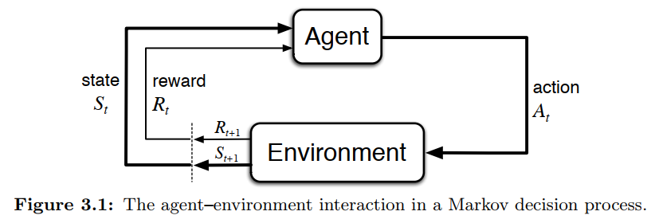

# 1. RL Course 1

- [1. RL Course 1](#1-rl-course-1)
  - [1.1. Assignment 1: Bandits and Exploration/Exploitation](#11-assignment-1-bandits-and-explorationexploitation)
  - [1.2. Week 2](#12-week-2)
    - [1.2.1. Markov decesion process (MDP)](#121-markov-decesion-process-mdp)
    - [1.2.2. Two types of tasks](#122-two-types-of-tasks)
    - [1.2.3. Discussion](#123-discussion)

## 1.1. Assignment 1: Bandits and Exploration/Exploitation

1. `argmax(q_values) => action: int` random choice of tied maximal `q_values`
1. `GreedyAgent.agent_step(self, reward, observation=None) => currentAction`

## 1.2. Week 2

### 1.2.1. Markov decesion process (MDP)

In MDP, actions influence not just immediate rewards like in *bandit problems*, but also subsequent situations, or states, and through those future rewards.

- Tradeoff: immediate and delayed rewards.
- Estimated values are different.
  - In *bandit problems*, we estimate the value of action $q_*(a)$.
  - In *MDP*, we estimate the value of an action $a$ in given state $s$, aka $q_*(s, a)$. 
  -  or we estimate the value $v_*(s)$ of each state given optimal action selections.

### 1.2.2. Two types of tasks

1. Episodic.
   1. The task ends at some point, so it has an *ending state*. From start to end, it's called an *episode*. E.g. playing games, solving mazes.
   1. Expected return:
      $$G_t := R_{t+1} + R_{t+2} + \dots + R_{T}$$
1. Continuing.
   1. The task never ends. The value of an action and state should take into account all future rewards.
   1. Expected return
      $$G_t := \sum_{k=1}^{\infty} \gamma^{k-1}R_{t+k}$$
      where $\gamma$ is the *discount rate*.
   1. 

### 1.2.3. Discussion

Question: The reward hypothesis states “that all of what we mean by goals and purposes can be well thought of as the maximization of the expected value of the cumulative sum of a received scalar signal (called reward).” Can you think of a situation that is **not** well-modeled by maximizing a scalar reward signal?

I think multiple-goal optimization problems are not well modeled by scalar reward signal. Consider this simple example: A computer needs to *learn how to distribute execution time among users*. Now if we simply assign each action a reward, where an action means to excute some user's task, this policy will result in some user's task not excuted at all, because the computer doesn't distinguish between different users. We can, however, change our reward and goal to some complicated functions that takes into account user's waiting time. Actually this is a typical problem in operating systems designs. We can do pretty well, but certainly not with single goal, or single scalar reward, because when our priorities changes, it'll be hard to change our algorithm accordingly.
